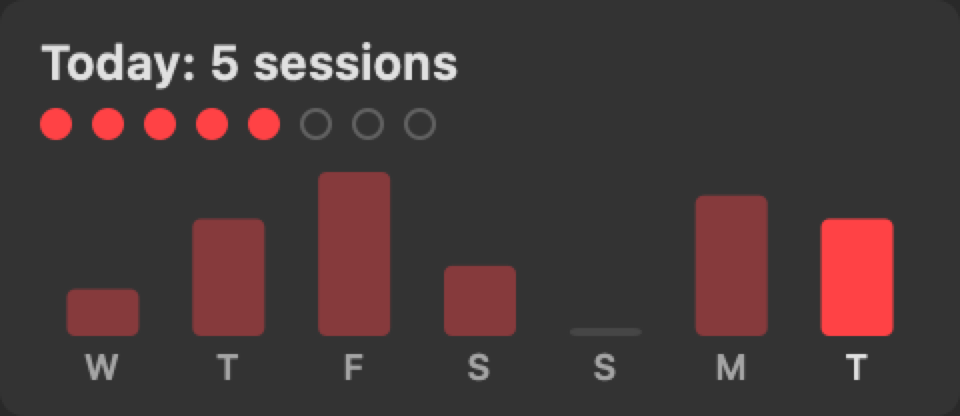

# PomodoroBar


A tiny, dependency-free macOS menu bar Pomodoro timer.
Work 25 minutes, break 5, long break 15 after every 4th round, for a configurable number of rounds.
A drawn progress ring and `MM:SS` countdown live in the menu bar; clicking it shows today's completed sessions as dots plus a 7-day history chart.
Shift+Cmd+A starts, pauses, and resumes the run from anywhere, no accessibility permissions required.

Optionally, while a work interval is running, the focused window is outlined in green via [JankyBorders](https://github.com/FelixKratz/JankyBorders), a visual "locked in" cue that pairs well with AeroSpace-style window gaps.
The border vanishes during breaks, pauses, and idle.

Sessions are announced by system sounds only (Glass at break time, Ping back to work, Hero when the run completes); there are no notifications, no network access, and no files beyond UserDefaults.

See [SPEC.md](SPEC.md) for the full behavioral and architectural specification.

## Widgets

**Menu bar ring and countdown** (red during work, green during breaks, dimmed when paused):


**Dropdown sessions view** (click the menu bar item):



Filled dots are today's completed sessions, hollow dots are what's left in the active run, and the chart shows the last seven days with today highlighted.

## Setup

### Option 1: install from a release

1. Download `PomodoroBar.app.zip` from the [latest release](../../releases/latest) and unzip it into `~/Applications`.
2. The bundle is unsigned, so clear the quarantine flag once:

   ```sh
   xattr -dr com.apple.quarantine ~/Applications/PomodoroBar.app
   ```

3. To run it at login, install the LaunchAgent (see below) or add the app to System Settings > General > Login Items.

### Option 2: build from source (recommended)

Requires macOS 13+ and the Swift toolchain from Xcode Command Line Tools (`xcode-select --install`); no full Xcode needed.

```sh
git clone https://github.com/emartinez-06/pomodoro-bar.git
cd pomodoro-bar
make install
```

`make install` builds the release binary, assembles `~/Applications/PomodoroBar.app`, writes a LaunchAgent to `~/Library/LaunchAgents/com.eim.pomodoro-bar.plist`, and starts it immediately.
The LaunchAgent starts the app at every login and relaunches it if it crashes; quitting from the menu stays quit until the next login.

For the green focus border, install JankyBorders and let PomodoroBar manage it (do not also run it as a service):

```sh
brew install felixkratz/formulae/borders
```

### Make targets

```sh
make build      # compile only
make test       # build + run the in-binary engine self-tests
make install    # build + install app bundle + LaunchAgent, start now
make restart    # rebuild and reinstall (bounces the agent)
make uninstall  # stop the agent, remove the app and plist
make logs       # tail the agent's stderr log
make dist       # assemble and zip a distributable app bundle
```

## Why a LaunchAgent and not a launch daemon?

Launch daemons run outside the user GUI session and cannot draw menu bar UI.
A per-user LaunchAgent with `RunAtLoad` is the correct mechanism for a menu bar app that starts at login.

## License

[MIT](LICENSE)
